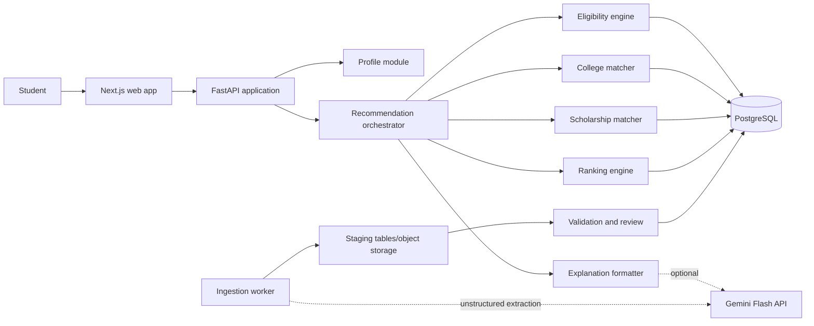

# ScholarRoute system architecture

Status: Phase 1 blueprint. No application code has been implemented.

## Scope and governing principles

ScholarRoute will initially support JEE Main engineering admissions, NEET UG/MBBS admissions, board-based eligibility, college recommendations, and scholarship recommendations. The product uses structured forms rather than a conversational interface.

The controlling decision chain is:

```text
Official source -> staged extraction -> validation -> published structured data
Published structured data + normalized student profile -> deterministic eligibility
Eligible candidates + stated preferences -> explainable ranking
Ranked results -> optional AI wording of an already-computed explanation
```

AI never grants or denies eligibility. Every returned result must identify the data release, rule versions, ranking-policy version, and source evidence used.

## Architectural style

Use a modular monolith for the API and decision engines, plus a separately executable ingestion worker in the same backend codebase. This provides strong module boundaries without the operational cost and distributed transactions of microservices.



### Deployable units

1. `web`: Next.js and TypeScript. Owns structured input, client-side validation, results, comparisons, and provenance display.
2. `api`: FastAPI modular monolith. Owns server validation, profiles, catalog queries, deterministic decision logic, recommendation runs, and audit traces.
3. `worker`: Python command/worker process from the same backend package. Owns downloads, parsing, AI-assisted extraction, validation, publication, and scheduled freshness checks.
4. `postgres`: transactional system of record. Enable pgvector only when semantic retrieval of source passages becomes a real requirement.
5. `object storage`: original PDFs, spreadsheets, HTML snapshots, checksums, and derived artifacts. Do not store large source binaries in PostgreSQL.
6. Optional managed queue/scheduler: triggers ingestion jobs. Start with provider-native scheduling and a PostgreSQL job table; add Redis only after measured contention or latency justifies it.

## Backend modules

| Module | Responsibility | Forbidden responsibility |
|---|---|---|
| `identity` | Map external auth subject to internal user and enforce access | Admission or scholarship decisions |
| `profiles` | Validate and normalize student facts and preferences | Provider-specific authentication logic |
| `catalog` | Read published institutions, programs, schemes, fees, rounds, and cutoffs | Data extraction or ranking |
| `rules` | Load, compile, and evaluate versioned predicates | AI calls or result ordering |
| `college_matching` | Produce eligible institution-program-offering candidates | Mutating published source data |
| `scholarship_matching` | Produce eligible scholarship opportunities and missing-evidence states | Treating unknown facts as false |
| `ranking` | Score eligible candidates using a versioned policy | Changing eligibility |
| `recommendations` | Orchestrate a run and persist its snapshot/trace | Embedding source-specific parsing |
| `explanations` | Build factual templates and optionally ask Gemini to restate them | Adding new eligibility claims |
| `ingestion` | Acquire, parse, stage, validate, review, and publish source releases | Serving student requests |
| `provenance` | Resolve facts and rules to source evidence | Editing source snapshots |
| `admin_review` | Human review queues, comparisons, approvals, and rollbacks | Public user features |
| `observability` | Structured logs, metrics, trace IDs, and audit events | Logging sensitive profile values by default |

Dependencies point inward: HTTP routes call application services; services call domain modules; domain modules use repository interfaces; infrastructure implements those interfaces. Engine tests must run without HTTP, an auth provider, Gemini, or a live database.

## Recommended repository structure

```text
ScholarRoute/
  apps/
    web/                         # Next.js application
    api/                         # FastAPI entry point and HTTP adapters
  packages/
    contracts/                   # Generated OpenAPI TypeScript client/types
    ui/                          # Shared presentation components, when justified
  backend/
    scholarroute/
      domain/
        common/
        profiles/
        eligibility/
        college_matching/
        scholarship_matching/
        ranking/
        provenance/
      application/
        recommendations/
        catalog/
        ingestion/
        admin_review/
      infrastructure/
        db/
        auth/
        object_store/
        gemini/
        telemetry/
      entrypoints/
        api/
        worker/
    migrations/                  # Alembic migrations
    tests/
      unit/
      integration/
      contract/
      fixtures/
  data-contracts/                # Versioned source mappings and controlled vocabularies
  docs/
  infra/                         # Deployment definitions added in a later phase
  scripts/                       # Narrow developer/operations commands only
  .env.example                   # Names, never values, of required settings
```

Avoid separate repositories and microservices during the MVP. Keep frontend and backend lockfiles independent because they use different ecosystems.

## End-to-end recommendation flow

1. The web app obtains a provider token and submits a structured request. The API also supports an authenticated saved-profile ID; an anonymous preview can be considered later.
2. Pydantic validates shape and ranges. The profile module maps external labels to stable IDs and records unknown or omitted attributes explicitly.
3. The orchestrator pins a `catalog_release_id`, `rule_set_version`, and `ranking_policy_version` at the start of the transaction.
4. Candidate preselection uses relational predicates such as exam, admission year, course, state, and application window.
5. The eligibility engine evaluates rules and returns `ELIGIBLE`, `INELIGIBLE`, or `NEEDS_INFORMATION`, with a trace for every material predicate.
6. Each matcher converts eligible offerings or schemes into a shared candidate shape. Scholarship results may remain `NEEDS_INFORMATION` if a required credential has not been provided.
7. The ranking engine calculates deterministic factor values, normalizes them within the candidate set, applies the selected policy, and records score components.
8. The API persists a recommendation run and its compact trace. Results include reasons, material caveats, data freshness, and source references.
9. Template explanations are always available. If enabled, Gemini receives only the computed facts and trace; its output is schema-validated and labeled as generated wording.

## Authentication boundary

Define an internal `AuthenticatedPrincipal { subject, issuer, email_verified, roles }`. A Clerk or Supabase adapter validates tokens and maps them to this type. Domain and application modules know only the internal user ID and roles.

Public catalog endpoints may remain unauthenticated with rate limits. Saved profiles, recommendation history, exports, and admin review require authentication. Admin authorization must use server-side roles, not client claims alone.

## Security and privacy

- Collect only attributes required for a recommendation; explain why sensitive category, religion, domicile, gender, income, or disability data is requested.
- Encrypt transport and managed storage, use a secrets manager, rotate credentials, and keep production access least-privileged.
- Separate personally identifiable profile data from reusable recommendation facts and source data. Recommendation traces should prefer internal IDs over raw user values.
- Redact request bodies and tokens from logs. Record actor, action, target, outcome, and trace ID in append-oriented audit events.
- Define retention and deletion for profiles, recommendation history, raw documents, and AI prompts. Users must be able to delete their saved data.
- Treat all downloaded documents and extracted text as untrusted input. Enforce MIME/size limits, malware scanning where available, parser isolation, timeouts, and no active-content execution.
- Prevent prompt injection from source documents by restricting Gemini to extraction against a schema and never allowing model output to publish or invoke tools autonomously.
- Use field-level access checks for admin review and prohibit exposing other students' data through sequential identifiers.

## Observability and operations

Use JSON logs with request/run/ingestion correlation IDs. Track API latency and error rates, eligibility outcome distribution, zero-result rate, rule failures, stale-source counts, ingestion validation failure rate, publication lag, Gemini calls/cost/errors, and explanation fallback rate. Do not put raw profiles or document text in telemetry.

## Deployment architecture

- Vercel hosts the Next.js web app.
- Cloud Run, Render, or Railway hosts the stateless API and separately configured worker image. Prefer Cloud Run when document-processing isolation and job execution are priorities.
- Neon, Supabase, or Cloud SQL hosts PostgreSQL. Select one provider before Phase 2 because connection pooling, extensions, backups, and IAM differ.
- Use provider object storage for immutable source snapshots and derived files.
- Run migrations as a controlled release step, not automatically on every API startup.
- Use separate development, staging, and production projects with distinct credentials and databases.
- Deploy API revisions before a web build that depends on new fields. Maintain backward-compatible API changes during rolling deployment.

## Changes to the presentation architecture

1. Remove Redis from the baseline. Introduce it only for a measured need such as distributed rate limiting or a high-cost cache with an invalidation plan.
2. Show PostgreSQL as a dependency of normalization and all engines, rather than a step after ranking.
3. Add immutable object storage and a human review/admin surface to the ingestion path.
4. Replace a single linear ingestion arrow with release staging and atomic publication. Student requests may read only `PUBLISHED` releases.
5. Represent `NEEDS_INFORMATION` as a first-class outcome; incomplete scholarship evidence must not become a false denial.
6. Separate matching from eligibility. Matching selects and shapes candidates only after eligibility evaluation.
7. Make non-AI, template-based explanations the default. Gemini may improve phrasing but cannot originate recommendation facts.

## Confirmations needed before Phase 2

The following choices change the domain model or delivery sequence:

- First vertical: JEE/JoSAA, NEET/MCC, or scholarships. The roadmap recommends JEE/JoSAA because its structured round and cutoff data exercises the core model.
- MVP geography and counselling scope: all-India quota only, or selected state authorities as well.
- Meaning of “admission chance”: strict historical cutoff comparison or a probabilistic forecast. The blueprint assumes a transparent historical band, not a guarantee or ML probability.
- Student account model: authentication required from first use or optional until saving results.
- Preference behavior: whether the branch-versus-college slider maps to a continuous ranking weight or a small set of named presets. Named, versioned presets are safer for the MVP.
- Scholarship application workflow: discovery only or document checklist, reminders, and application tracking. The blueprint includes discovery and evidence status only.
- Data-review ownership and service-level target: who approves extracted data and how quickly official updates must appear.
- Selected hosting, auth, object-storage, and email providers.

See [data-model.md](data-model.md), [ingestion.md](ingestion.md), [recommendation-engine.md](recommendation-engine.md), [api-design.md](api-design.md), and [implementation-roadmap.md](implementation-roadmap.md).
