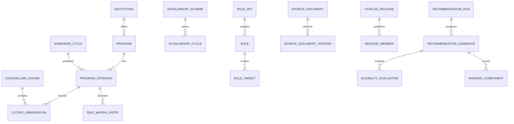

# ScholarRoute data model

## Modeling conventions

- Use UUID primary keys for business entities and `bigint` identities for high-volume append-only facts when appropriate.
- Use `timestamptz` in UTC, `numeric` for money and percentages, integer paise for calculated totals if arithmetic is frequent, and ISO codes where standards exist.
- Every year-sensitive fact belongs to a release or explicit effective interval. Never overwrite last year's rule, fee, seat, or cutoff.
- Model unknown values as null plus an explicit evaluation outcome. Do not use sentinel values such as `0` or `-1`.
- Use controlled vocabulary tables for categories, quotas, gender pools, boards, courses, credentials, and states. Source-specific strings map to these canonical IDs through versioned aliases.
- Published rows are immutable. Corrections create a new release and supersede the old release.

## Entity groups

### Identity and profiles

| Entity | Important fields and relationships |
|---|---|
| `users` | `id`, external `issuer`, external `subject`, status, timestamps; unique `(issuer, subject)` |
| `student_profiles` | `id`, `user_id`, display label, domicile state, category, gender, household income band/value, consent timestamps, revision |
| `student_exam_results` | profile, exam, year, rank type, rank, percentile, score; unique per profile/exam/year/rank type |
| `student_board_results` | profile, board, year, aggregate percentage and subject-level results |
| `student_preferences` | profile revision, course/branch preferences, location preferences, annual budget, ranking preset |
| `student_credentials` | profile, credential type, issuer, date/level/value, verification state; store document references separately |

Sensitive demographic fields belong to the profile module and should be exposed to engines only as a purpose-limited normalized snapshot.

### Reference catalog

| Entity | Important fields and relationships |
|---|---|
| `exams` | JEE Main, NEET UG, board paths; stable code |
| `boards`, `states`, `categories`, `quota_types`, `gender_pools` | canonical vocabularies and validity intervals |
| `institutions` | canonical institution identity, type, state, status, official identifiers |
| `institution_names` | historical/alternate names with validity and source |
| `campuses` | institution, address/state, coordinates if verified |
| `courses` | Engineering, MBBS, and future course families |
| `branches` | canonical specialization/course option and aliases |
| `programs` | institution + course/branch + campus; stable across admission years where possible |
| `counselling_authorities` | JoSAA, MCC, and approved state bodies |
| `admission_cycles` | authority, exam, academic year, state/scope, status |
| `counselling_rounds` | cycle, source round code, sequence, round type, dates |
| `program_offerings` | program + admission cycle + quota/category/gender pool applicability |
| `seat_matrix_entries` | offering/round, seat pool, count, release |
| `cutoff_observations` | offering/round, rank type, opening rank, closing rank, release |
| `fee_schedules` | institution/program, academic year, fee components, currency, applicability |
| `quality_signals` | institution, metric type, value, methodology/year, source; never collapse unlike metrics into one opaque score |

Keep a cutoff as an observation, not a rule. Historical cutoffs inform ranking and context; current official eligibility rules decide eligibility.

### Rules

| Entity | Important fields and relationships |
|---|---|
| `rule_sets` | domain, authority, admission/scheme year, semantic version, status, release |
| `rules` | rule set, stable code, outcome severity, expression AST as JSONB, human summary, effective interval |
| `rule_targets` | rule to scholarship, admission cycle, program/offering, or scoped taxonomy node |
| `rule_evidence` | rule, source document/version, locator/page/table/cell, quotation hash |
| `rule_test_cases` | input fixture, expected outcome, provenance, reviewer |

Use a constrained expression schema, not executable Python or SQL. Example nodes: `all`, `any`, `not`, comparison, membership, existence, date-window, and controlled lookup. The compiler validates allowed attributes, types, and operators.

### Scholarships

| Entity | Important fields and relationships |
|---|---|
| `scholarship_schemes` | canonical scheme, provider, official code, status |
| `scholarship_cycles` | scheme, academic year, application window, status, release |
| `scholarship_benefits` | cycle, benefit type, amount/range, frequency, duration, constraints |
| `scholarship_requirements` | cycle, credential/document type, required/conditional flag |
| `scholarship_rule_sets` | cycle to rule set association |

Do not encode complex criteria in prose-only columns. Preserve prose for display and evidence, but publish a validated executable rule representation.

### Ingestion and provenance

| Entity | Important fields and relationships |
|---|---|
| `data_sources` | authority, canonical URL/domain, source type, trust tier, retrieval policy |
| `source_documents` | source, canonical URI, title, publication date, academic year, media type |
| `source_document_versions` | document, content hash, retrieved time, storage URI, HTTP metadata, parser version, supersedes |
| `ingestion_runs` | connector/parser version, trigger, status, timings, metrics, error summary |
| `extraction_batches` | run, document version, method, Gemini model/prompt/schema versions, status |
| `staged_records` | batch, entity type, raw payload, normalized proposal, validation findings, status |
| `validation_findings` | staged record/run, rule code, severity, message, evidence locator |
| `catalog_releases` | domain/year, version, status, created/approved/published metadata |
| `release_members` | release to immutable fact rows or dataset partitions |
| `publication_events` | release, reviewer, decision, previous release, reason |

Recommended states are `RECEIVED`, `PARSED`, `EXTRACTED`, `VALIDATION_FAILED`, `REVIEW_REQUIRED`, `APPROVED`, `PUBLISHED`, `REJECTED`, and `SUPERSEDED`. Publication is a release-level action, not an in-place status flip on arbitrary production rows.

### Recommendations and audit

| Entity | Important fields and relationships |
|---|---|
| `recommendation_runs` | user/profile snapshot reference, request hash, catalog/rule/ranking versions, timestamps, status |
| `recommendation_candidates` | run, target type/ID, eligibility state, total score, rank position |
| `eligibility_evaluations` | candidate, rule code/version, result, input refs, reason code, evidence refs |
| `ranking_components` | candidate, factor code/version, raw value, normalized value, weight, contribution |
| `explanation_artifacts` | candidate/run, template version, optional model/version, input hash, output, safety status |
| `audit_events` | actor, action, target, timestamp, request ID, metadata without secrets/PII |

Persist the normalized profile snapshot or a canonical hash plus retained snapshot data needed to reproduce the result. A pointer to a mutable current profile is insufficient.

## Core relationships

## Constraints

- `opening_rank > 0`, `closing_rank > 0`, and interpretation-specific ordering checks where the rank type supports them.
- Percentages between 0 and 100; monetary amounts non-negative; seat counts non-negative; start dates do not follow end dates.
- Prevent overlapping effective intervals for the same canonical mapping or active rule version using exclusion constraints where practical.
- A release may become `PUBLISHED` only after approval, zero blocking findings, and required source evidence.
- A recommendation candidate cannot have a score unless its eligibility state is `ELIGIBLE`. `NEEDS_INFORMATION` results may be shown separately without a competitive rank.
- One active published release per domain, authority/scope, and academic year, while preserving all prior releases.
- Source version content hashes are unique per document; object storage keys are immutable.
- Use foreign keys for all controlled vocabulary and version references. Avoid free-text category, state, exam, quota, or status values in fact tables.

## Indexes and partitioning

- B-tree composite indexes matching preselection: program offerings by `(admission_cycle_id, course_id, branch_id, state_id)` and cutoff observations by `(offering_id, round_id, category_id, quota_type_id, gender_pool_id, rank_type)`.
- Partial indexes on active/published cycles, releases, schemes, and unresolved validation findings.
- Scholarship candidate lookup indexes for cycle status and dates; use normalized link tables and B-tree indexes for categorical criteria rather than a wide GIN-only JSON design.
- GIN indexes on rule JSONB only for administration/search, not for evaluating rules on every request.
- Unique normalized external identifiers per authority and entity type.
- Recommendation and audit tables indexed by user/time and run ID; consider time partitioning only after volume warrants it.
- Full-text search index for catalog discovery if needed. Add pgvector HNSW/IVFFlat indexes only after a semantic retrieval use case, embedding model, and recall target have been selected.

## Migration and compatibility policy

Use Alembic, review generated migrations, and apply expand/migrate/contract changes across releases. Seed only stable controlled vocabularies through migrations. Domain datasets use ingestion releases, not migration scripts. Never delete a published fact required to reproduce a historical recommendation.

## Phase 3 canonical implementation

The Phase 3 migration adds controlled vocabularies for exam types, degrees, subjects,
quotas, gender pools, seat types, and academic years. Admission facts are represented
by counselling rounds, program offerings, cutoff observations, seat matrices, fees,
and year-scoped admission requirements. Scholarship data is represented by providers,
schemes, year/rule-version cycles, structured eligibility-rule data, benefits, and
required documents.

The reusable official-link entity is named resource_links. It stores the target entity
type and ID, link type, URL, applicable year, source authority, verification time,
and source document version, so recommendation responses can retrieve official
institution, program, counselling, scholarship, application, and guideline links
without a new search.

staged_records and validation_findings provide the explicit
RAW -> PARSED -> NORMALIZED -> VALIDATED -> PUBLISHED or REJECTED lifecycle.
Published facts retain the source document version and source locator. Historical
years use independent admission/scholarship cycles and observations.
