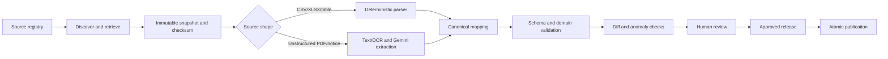

# ScholarRoute data ingestion

## Goals

The ingestion system converts official documents into reviewable, versioned releases. It optimizes for correctness and traceability before speed. Commercial aggregation sites must not seed the core dataset.

## Pipeline

### 1. Source registry and discovery

Register an authority, canonical domain, dataset type, expected cadence, supported years, retrieval method, and terms/robots review. Discovery creates candidate document records; it never publishes facts. Prefer direct official files or APIs over rendered page scraping.

### 2. Retrieval and immutable evidence

Fetch with timeouts, retry limits, conditional requests, size caps, and an identifiable user agent. Record final URL, HTTP headers, retrieval time, media type, byte size, and SHA-256. Store the original bytes under a content-addressed immutable key. Identical content does not create a new version.

### 3. Parsing and extraction

Use source-specific deterministic adapters for CSV, XLSX, and stable tables. Each parser emits a versioned intermediate schema and cell/table/page locators.

For unstructured sources, first extract text and layout locally. Send only relevant passages or pages to Gemini with:

- a strict JSON schema and enumerated fields;
- the document version and locator identifiers;
- instructions to return null rather than infer missing values;
- confidence per field and the supporting text span;
- a pinned model family/configuration, prompt version, and schema version.

Model output remains an extraction proposal. It cannot write published tables.

### 4. Normalization

Map source labels to canonical institutions, programs, states, categories, quotas, gender pools, and rounds using versioned alias tables. Unresolved or ambiguous mappings enter a review queue. Never silently create a new institution from a fuzzy match.

Normalize units without losing the original representation. Examples include annual versus semester fees, rupees versus another currency, rank type, marks versus percentage, and time zone for application deadlines.

### 5. Validation

Validation layers:

1. Schema: types, required fields, enums, and format.
2. Referential: all mappings resolve and referenced rounds/cycles exist.
3. Domain: rank, percentage, date, money, seat, and rule-expression constraints.
4. Cross-record: duplicate keys, overlapping rules, opening/closing consistency, totals versus seat detail.
5. Historical anomaly: unexpected volume changes, missing categories, implausible cutoff shifts, or a large record-count delta.
6. Evidence: every material published fact and rule has a document version and locator.

Blocking findings prevent release approval. Warnings require reviewer disposition.

### 6. Diff and review

Present additions, removals, changed values, unresolved mappings, anomalies, and exact source evidence. Require two-person review for high-impact rule changes when operations permit. Record the reviewer and reason for overrides.

### 7. Publication and rollback

Publish an internally consistent release in one database transaction by moving the active release pointer. Student traffic never reads staging tables. Rollback changes the pointer to the prior valid release; it does not destroy the faulty release or its evidence.

## Initial connectors

Implement one vertical at a time. Recommended first slice:

- JoSAA: institutes/programs, seat matrices, rounds, and opening/closing ranks for one admission year plus one historical year.
- NTA: exam metadata only where it affects normalization; do not duplicate student result services.
- Official institute sources: fee data after the JoSAA catalog is stable.

MCC/NMC and scholarship sources follow through separate adapters because their rule shapes and review needs differ. “Official state authorities” is a family of sources, not one connector.

## Scheduling and idempotency

Use an `ingestion_runs` table with a unique idempotency key derived from source, dataset, target year, and content hash. Scheduled discovery can run daily during active cycles and less often otherwise. Parsing and validation may be retried safely; publication requires an explicit approved release.

Use PostgreSQL advisory locks or unique run constraints initially. Add a dedicated queue only when parallel workload and failure recovery exceed the simple worker model.

## Failure handling

- Quarantine corrupt, encrypted, oversized, or unexpected files.
- Preserve partial diagnostics but never partial publication.
- Use bounded retries for transient retrieval and model failures; deterministic validation failures require data or mapping changes.
- Alert on stale critical sources, repeated connector failures, blocking findings, and a change to an official document after publication.
- Fall back to manual upload by an authorized reviewer only when the official download mechanism fails, preserving the official URL and document checksum.

## Testing

- Golden-file tests for every parser and representative source year.
- Property tests for normalization invariants and rule-expression parsing.
- Contract tests against saved official fixtures, not live websites in CI.
- Mutation/regression tests for known source format changes.
- Release tests proving staging isolation, atomic publication, and rollback.
- AI extraction evaluation set with field-level precision/recall and mandatory abstention tests. A model or prompt change must pass the set before use.

## Operational acceptance criteria

A release is publishable only when all required documents have immutable snapshots, all material fields resolve to evidence, blocking findings equal zero, rule test cases pass, anomalies have dispositions, and an authorized reviewer approves the release.
